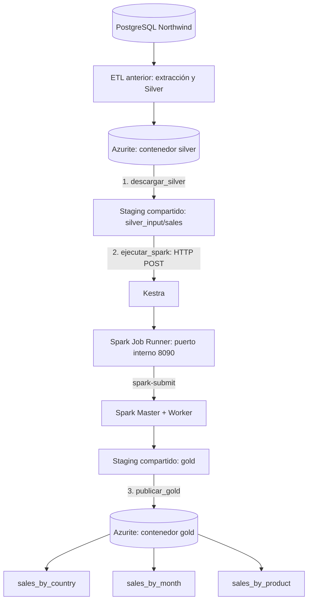

# Northwind Data Platform — MVP 7

**Tema:** Orquestación Silver → Gold con Kestra, Apache Spark y Azurite  
**Estado:** Completado y verificado el 23 de septiembre de 2026  
**Entorno:** macOS Apple Silicon + Podman Compose  
**Propósito del documento:** Permitir retomar el laboratorio sin reconstruir el contexto ni repetir pruebas innecesarias.

## 1. Objetivo y resultado

Automatizar la transformación de los datos Silver a tres agregados Gold y publicarlos en Azure Blob Storage emulado localmente mediante Azurite. Kestra coordina tres tareas secuenciales: descargar Silver, solicitar la ejecución de Spark y publicar Gold.

**Resultado comprobado:** la solicitud HTTP de Kestra al ejecutor Spark devolvió `HTTP 200`, `status: SUCCESS` y `exit_code: 0`; posteriormente se verificó mediante el SDK de Azure que el contenedor `gold` contiene un Parquet en cada uno de los tres prefijos: `sales_by_country`, `sales_by_month` y `sales_by_product`.

## 2. Arquitectura y flujo de datos



**Lectura correcta:** el archivo Silver es descargado por Kestra al staging compartido; Kestra no procesa los datos con Spark directamente. Hace una petición HTTP al servicio `spark-job-runner`, que ejecuta `spark-submit` contra el clúster. Una vez finalizada correctamente esa tarea, Kestra publica los Parquet Gold.

### Responsabilidades

| Componente | Responsabilidad |
|---|---|
| PostgreSQL Northwind | Fuente de datos del laboratorio. |
| Azurite `silver` | Almacenamiento del Parquet Silver generado en etapas previas. |
| Kestra | Orquestación, orden de ejecución y logs por tarea. |
| Staging compartido | Intercambio de archivos entre Kestra y Spark. |
| Spark Job Runner | API HTTP interna que lanza `spark-submit` y devuelve éxito/error. |
| Spark Master + Worker | Procesamiento distribuido Silver → Gold. |
| Azurite `gold` | Publicación de los agregados para consumo posterior. |

## 3. Rutas y servicios importantes

**Directorio del Compose (con la grafía real `nortwind`):**

```text
/Users/yasmanirosado/Documents/dev/container/nortwind-data-platform
```

**Repositorio Python:**

```text
/Users/yasmanirosado/Documents/dev/python/etl_v1
```

**Ruta relativa desde el Compose:** `../../python/etl_v1`.

| Recurso | Ruta o nombre |
|---|---|
| Compose | `podman-compose.yml` |
| Transformación Spark | `etl_v1/spark/silver_to_gold_v6.py` |
| API del ejecutor | `etl_v1/spark/job_runner.py` |
| Descarga de Silver | `etl_v1/storage/stage_silver.py` |
| Publicación Gold | `etl_v1/storage/upload_gold.py` |
| Script Spark dentro del contenedor | `/opt/spark/northwind-jobs/silver_to_gold_v6.py` |
| Staging dentro de Spark | `/opt/spark/staging` |
| Repositorio dentro de Kestra | `/app/northwind` |
| Python de Kestra | `/opt/northwind-venv/bin/python` |
| Spark Master | `northwind-spark-master` |
| Spark Worker | `northwind-spark-worker` |
| Ejecutor HTTP | `northwind-spark-job-runner` |
| Kestra | `northwind-kestra` |
| URL interna de ejecución | `http://spark-job-runner:8090/jobs/silver-to-gold` |
| URL interna de salud | `http://spark-job-runner:8090/health` |

**Importante:** `spark-job-runner` es un nombre DNS interno de la red Compose. Se resuelve desde Kestra, pero no directamente desde la terminal del Mac; no se publicó el puerto 8090 en el host.

## 4. Diseño del Spark Job Runner

Se creó un servicio independiente `spark-job-runner` usando la misma imagen de Spark (`spark:4.2.0-java21-python3`). Monta el staging y los scripts Spark, y ejecuta `/usr/bin/python3 -u /opt/spark/northwind-jobs/job_runner.py`.

Su API expone:

- `GET /health`: responde con `status: UP`; no ejecuta transformaciones.
- `POST /jobs/silver-to-gold`: invoca `spark-submit` en modo cliente contra `spark://spark-master:7077`.

Configuración clave de `spark-submit`:

```text
--master spark://spark-master:7077
--deploy-mode client
--conf spark.driver.host=spark-job-runner
--conf spark.driver.bindAddress=0.0.0.0
/opt/spark/northwind-jobs/silver_to_gold_v6.py
```

El servicio usa un bloqueo para evitar dos ejecuciones simultáneas; devuelve `409 BUSY` si ya existe un trabajo en curso. Captura el resultado del proceso y devuelve `200 SUCCESS` con `exit_code: 0` o un error HTTP con información de diagnóstico. El tiempo máximo configurado en el ejecutor es de 900 segundos; el cliente de la prueba espera hasta 1000 segundos.

**Motivo de esta solución:** Kestra disponía de Python, pero no del ejecutable `spark-submit` ni de un socket de contenedores adecuado para lanzar Spark directamente. El ejecutor HTTP separa la orquestación del entorno de ejecución Spark.

## 5. Flow de Kestra: tres tareas

Identificador usado:

```text
namespace: northwind
id: northwind_silver_to_gold_v1
```

La configuración del Flow propuesta e integrada fue:

```yaml
id: northwind_silver_to_gold_v1
namespace: northwind

concurrency:
  limit: 1
  behavior: QUEUE

tasks:
  - id: descargar_silver
    type: io.kestra.plugin.scripts.shell.Commands
    taskRunner:
      type: io.kestra.plugin.core.runner.Process
    commands:
      - cd /app/northwind
      - /opt/northwind-venv/bin/python -m storage.stage_silver

  - id: ejecutar_spark
    type: io.kestra.plugin.scripts.shell.Commands
    taskRunner:
      type: io.kestra.plugin.core.runner.Process
    commands:
      - |
        /opt/northwind-venv/bin/python - <<'PY'
        import json
        import urllib.request

        url = "http://spark-job-runner:8090/jobs/silver-to-gold"
        request = urllib.request.Request(url, data=b"", method="POST")

        with urllib.request.urlopen(request, timeout=1000) as response:
            result = json.loads(response.read().decode())

        print(json.dumps(result, indent=2))
        if result.get("status") != "SUCCESS":
            raise RuntimeError("La transformación Spark no finalizó correctamente")
        PY

  - id: publicar_gold
    type: io.kestra.plugin.scripts.shell.Commands
    taskRunner:
      type: io.kestra.plugin.core.runner.Process
    commands:
      - cd /app/northwind
      - /opt/northwind-venv/bin/python -m storage.upload_gold
```

**Nota:** este bloque conserva el Flow utilizado en el intercambio. Si se modifica el proyecto, revisar que los comandos mantengan el directorio de trabajo `/app/northwind` y que las tareas sigan ejecutándose secuencialmente. La configuración de concurrencia evita que dos ejecuciones del mismo Flow interfieran al limpiar el staging.

### ¿Qué hace cada tarea?

1. **`descargar_silver`**: elimina el archivo anterior del staging, localiza el Parquet en Azurite `silver/sales` y lo descarga en `staging/silver_input/sales/`.
2. **`ejecutar_spark`**: solicita por HTTP la transformación; el ejecutor llama a Spark y espera su finalización. Una respuesta HTTP de error hace fallar la tarea.
3. **`publicar_gold`**: toma los Parquet de `staging/gold/` y los publica bajo tres prefijos del contenedor `gold` en Azurite. El código actual reemplaza los blobs anteriores de cada prefijo.

## 6. Transformación Silver → Gold y conciliación

El script `silver_to_gold_v6.py` genera:

| Dataset | Descripción |
|---|---|
| `sales_by_country` | Ventas agregadas por país. |
| `sales_by_month` | Ventas agregadas por mes. |
| `sales_by_product` | Ventas agregadas por producto. |

**Evidencia de la ejecución manual previa:** el agregado por producto produjo 77 productos; la conciliación mostró `Total Silver: 1265793.25` y `Total Gold: 1265793.25`, con resultado `OK`. La ejecución posterior solicitada desde Kestra finalizó con `exit_code: 0` y el log del ejecutor terminó en `GOLD FINALIZADO`.

En la versión del laboratorio se indicó convertir las discrepancias de conciliación en excepciones (`raise ValueError`) para que Spark falle y Kestra no publique un resultado inconsistente. Verificar que esa regla siga presente si se edita el script.

## 7. Publicación Gold y precauciones

El módulo `storage/upload_gold.py` trabaja con:

```python
GOLD_CONTAINER = "gold"
GOLD_DATASETS = ["sales_by_country", "sales_by_month", "sales_by_product"]
```

Para cada dataset localiza los `part-*.parquet`, elimina los blobs anteriores del prefijo y sube los nuevos. Se propuso una validación previa de los tres datasets (existencia de Parquet y del marcador `_SUCCESS`) **antes de eliminar ningún blob remoto**. Si se retoma el código, confirmar que esa validación se guardó y que la ausencia de archivos provoca una excepción, no un `continue` silencioso.

**Limitación conocida:** borrar y subir por prefijo no es una publicación atómica; una interrupción entre ambas operaciones puede dejar un dataset remoto temporalmente incompleto. Es suficiente para el laboratorio, pero sería un punto de mejora para producción.

## 8. Evidencias observadas de la ejecución integral

### `descargar_silver`

```text
[SILVER-STAGING] Archivos anteriores: 1
[SILVER-STAGING] Parquet encontrados: 1
[STAGING] Descargando: silver/sales/part-00000-...snappy.parquet
[STAGING] Archivo disponible en: staging/silver_input/sales/part-00000-...snappy.parquet
[SILVER-STAGING] Finalizado
```

Duración observada aproximada: **0.74 s**.

### `ejecutar_spark`

```json
{
  "status": "SUCCESS",
  "exit_code": 0,
  "message": "Silver \u2192 Gold finalizado"
}
```

Duración observada aproximada: **7.85 s**. `\u2192` es la representación JSON de la flecha `→`, no un error.

### `publicar_gold`

Los logs mostraron un Parquet por dataset y el reemplazo de los blobs anteriores. La salida copiada inicialmente terminaba tras eliminar el blob anterior de `sales_by_product`; por ello se hizo una verificación independiente en Azurite, que confirmó la presencia del nuevo archivo de producto. Duración observada aproximada: **0.18 s**.

### Verificación independiente en Azurite

```text
[GOLD] sales_by_country: 1 archivos Parquet
  -> sales_by_country/part-00000-abf2e4c9-a993-47a9-9c6a-88fe63e52712-c000.snappy.parquet
[GOLD] sales_by_month: 1 archivos Parquet
  -> sales_by_month/part-00000-97fba5df-4fce-46d7-bf34-297918d56f36-c000.snappy.parquet
[GOLD] sales_by_product: 1 archivos Parquet
  -> sales_by_product/part-00000-bae7f40c-5377-42ac-bdb6-b3d08c038fde-c000.snappy.parquet
```

Esta comprobación demuestra que los tres Parquet están publicados. **No sustituye una auditoría completa de calidad de datos**, prevista para el MVP 8.

## 9. Comandos útiles para retomar el laboratorio

### Validar Compose

```bash
cd /Users/yasmanirosado/Documents/dev/container/nortwind-data-platform
podman compose -f podman-compose.yml config
podman compose -f podman-compose.yml config --services
```

`podman-compose` 1.3.0 no aceptó `config --quiet`; el error `unrecognized arguments: --quiet` era de compatibilidad del comando, no del YAML.

### Ver el estado de Spark y el ejecutor

```bash
podman ps -a --filter name=northwind-spark
podman logs --tail 80 northwind-spark-job-runner
```

### Levantar solo el ejecutor, sin recrear Master ni Worker

```bash
podman compose -f podman-compose.yml up -d --no-deps --no-build spark-job-runner
```

### Comprobar conectividad interna desde Kestra (no modifica datos)

```bash
podman exec northwind-kestra /opt/northwind-venv/bin/python -c '
import urllib.request
with urllib.request.urlopen("http://spark-job-runner:8090/health", timeout=10) as r:
    print("HTTP STATUS:", r.status)
    print("BODY:", r.read().decode())
'
```

Respuesta verificada:

```text
HTTP STATUS: 200
BODY: {"status": "UP", "service": "northwind-spark-job-runner"}
```

### Ejecutar Spark manualmente a través del runner (sí reprocesa Gold)

```bash
podman exec northwind-kestra /opt/northwind-venv/bin/python -c '
import json
import urllib.request
request = urllib.request.Request(
    "http://spark-job-runner:8090/jobs/silver-to-gold",
    data=b"",
    method="POST"
)
with urllib.request.urlopen(request, timeout=1000) as r:
    print("HTTP STATUS:", r.status)
    print(json.dumps(json.loads(r.read().decode()), indent=2))
'
```

**No lanzar este POST si ya está ejecutándose el Flow:** el ejecutor bloquea ejecuciones simultáneas y ambos procesos comparten el staging.

### Comprobar los tres Parquet publicados (solo lectura)

```bash
podman exec northwind-kestra /opt/northwind-venv/bin/python -c '
import os
from azure.storage.blob import BlobServiceClient
service = BlobServiceClient.from_connection_string(
    os.environ["AZURE_STORAGE_CONNECTION_STRING"]
)
container = service.get_container_client("gold")
for dataset in ["sales_by_country", "sales_by_month", "sales_by_product"]:
    blobs = [
        blob for blob in container.list_blobs(name_starts_with=f"{dataset}/")
        if blob.name.endswith(".parquet")
    ]
    print(f"[GOLD] {dataset}: {len(blobs)} archivos Parquet")
    for blob in blobs:
        print("  ->", blob.name)
'
```

No es necesario importar `storage.blob_client_general` para esta consulta; aquella importación causó un `ModuleNotFoundError` innecesario en una prueba anterior.

## 10. Incidencias resueltas y aprendizajes

| Incidencia | Causa y solución |
|---|---|
| `config --quiet` no reconocido | La versión local de `podman-compose` no admite esa opción; usar `config` sin `--quiet`. |
| `zsh: command not found: POST` | `POST` es un método HTTP, no un comando de shell. Usar un cliente HTTP con `method="POST"`. |
| `curl: Could not resolve host: spark-job-runner` desde macOS | El nombre DNS solo existe en la red de contenedores; realizar la petición desde Kestra. |
| `curl -x ...` falló | `-x` significa proxy, no método HTTP. |
| `\u2192` en JSON | Codificación Unicode de la flecha; no es un error. |
| `ModuleNotFoundError` en la consulta de Azurite | La importación del módulo del proyecto no era necesaria; usar directamente `azure.storage.blob.BlobServiceClient`. |
| Riesgo de ejecuciones concurrentes | Se propuso `concurrency: limit: 1, behavior: QUEUE` y un bloqueo en el runner. |
| Falta de Spark CLI en Kestra | Se incorporó un contenedor HTTP independiente con la imagen Spark. |

## 11. Estado final y siguiente MVP

**MVP 7: completado.** Se verificaron la comunicación Kestra → runner, la ejecución de Spark, la conciliación observada y la publicación de tres Parquet en Azurite Gold.

**MVP 8 — Data Quality (pendiente):** incorporar validaciones automáticas de datasets vacíos, campos obligatorios nulos, duplicados y conciliaciones Silver/Gold, y hacer que Kestra detenga la publicación cuando falle una regla crítica. También conviene reforzar la publicación con validación previa y, más adelante, una estrategia de reemplazo atómico/versionado.

### Regla para continuar sin perder contexto

1. Comprobar que los contenedores estén activos y que `/health` responda.
2. Abrir en Kestra el Flow `northwind_silver_to_gold_v1` y revisar sus tres tareas.
3. Ejecutar el Flow **una sola vez** cuando se necesite reprocesar.
4. Verificar los tres prefijos de Azurite `gold` con el comando de solo lectura.
5. Continuar con MVP 8; no rehacer MVP 7 salvo que cambien scripts, montajes o configuración.
